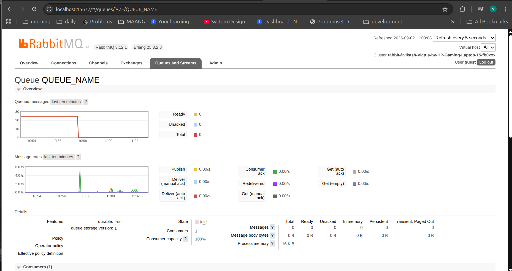
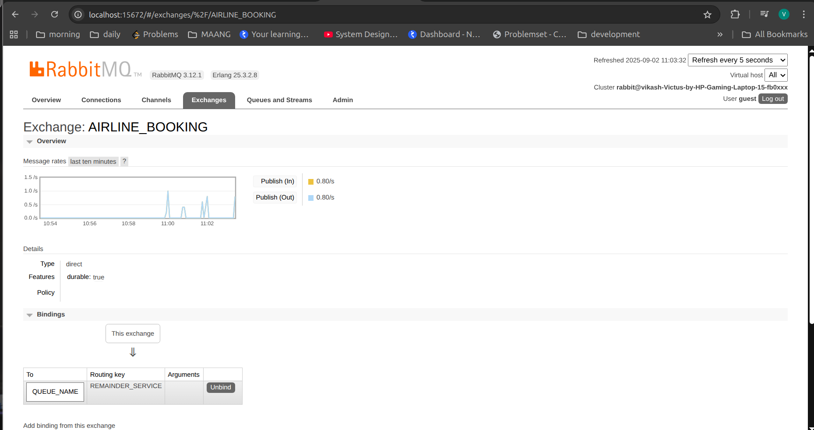
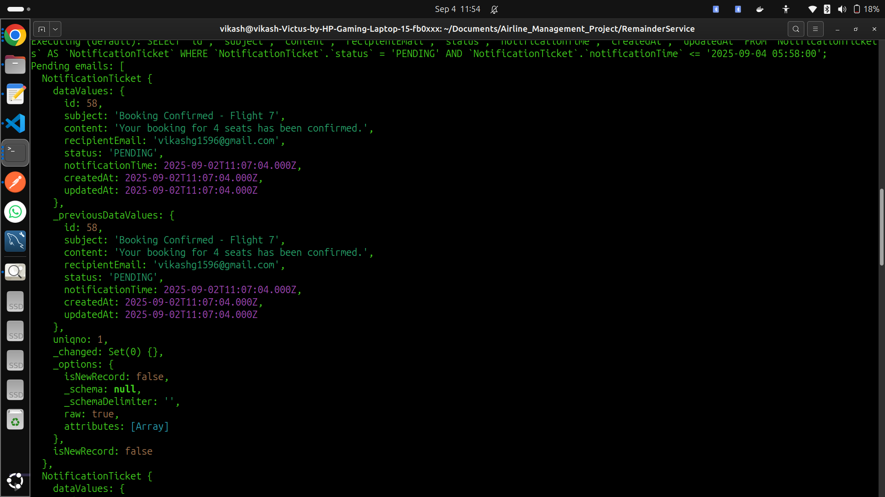
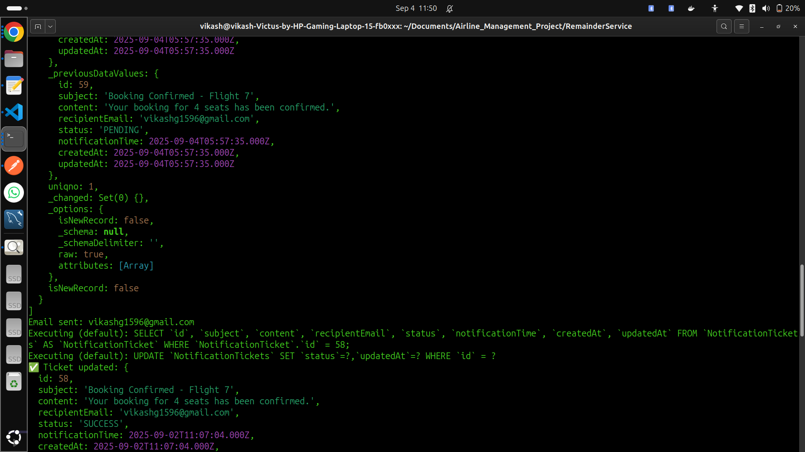

# AirTicket Reminder Service

This repository contains the **Reminder Service** for the AirTicket backend.  
It handles **email notifications** for bookings using **RabbitMQ** and **cron jobs**.

## Overview

- Built using **Node.js** with modular code for clarity and maintainability.
- **Monitors bookings** and sends email notifications when a booking is processed.
- Uses **RabbitMQ** for asynchronous message queuing between services.
- **Cron job** periodically checks the booking status and triggers emails.
- Supports **dynamic confirmation emails**:
  - Initial booking confirmation
  - Follow-up confirmation when the booking status updates
- For testing, a **2-minute delay** is implemented to simulate real-time updates.

## Related Projects / Services

- [AirTicket Auth Service](https://github.com/VIKASH1596KUMARKHARWAR/Auth_Service)

- [AirTicket Flight Service](https://github.com/VIKASH1596KUMARKHARWAR/FlightAndSearchService)

- [AirTicket Booking Service](https://github.com/VIKASH1596KUMARKHARWAR/AirTicket_BookingService)

- [AirTicket API Gateway] (https://github.com/VIKASH1596KUMARKHARWAR/AirTicket_API_GATEWAY)

## Assets

  
_inital_

  
_Process out_

  
_Our Reaminder Queue_

  
_ticket creation for the queue to service Pending Booking mark to confirm _

  
_ticket creation for the queue to service SendMail, Email Sent on Booking Confirmed by the cron job _

---

## Architecture

Booking Service → RabbitMQ → Reminder Service → Email

Cron Job in Reminder Service checks pending bookings every interval

---

## Key Features

- **Asynchronous Messaging**:

  - Uses RabbitMQ to decouple services and process messages reliably.

- **Email Notifications**:

  - Sends dynamic confirmation emails to users for each booking.
  - Sends follow-up emails after cron job confirms booking processing.

- **Cron Job**:

  - Periodically checks bookings for status updates.
  - Ensures delayed or pending bookings trigger the correct email sequence.

- **Testing Delay**:

  - 2-minute delay implemented for testing email flow without waiting for real booking time.

- **Modular JavaScript Structure**:

  - Clear separation of RabbitMQ listener, email sender, and cron job logic.

- **Asset Management**:
  - Email templates or static files can be placed in the `assets` folder.

---

## Learning Outcomes

- Hands-on experience with **asynchronous messaging** using RabbitMQ.
- Implemented **cron jobs** for periodic background tasks.
- Designed **dynamic email workflows** for booking confirmation.
- Learned **modular service design** in Node.js for scalable microservices.

---

## Usage

Clone the repository:

```
git clone git@github.com:VIKASH1596KUMARKHARWAR/AirTicket_RemainderService.git
cd AirTicket_Reminder_Service
```

## This README clearly explains:

- RabbitMQ usage
- Cron job workflow
- Dynamic email confirmation flow
- Testing setup (2-minute delay)
- Relation to other microservices
